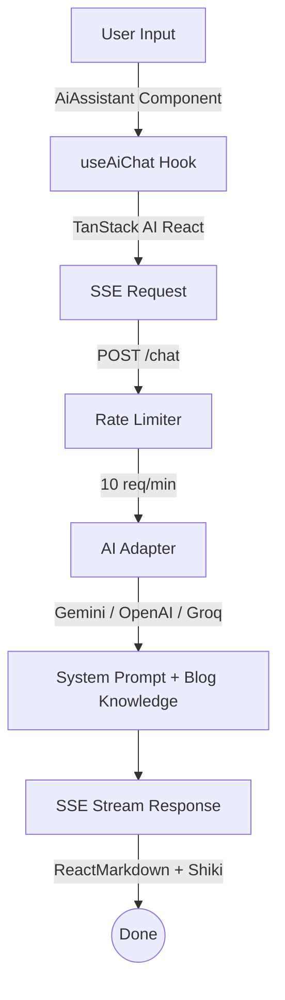

> 用 RADIO Pattern 拆解需求，從零打造一個能自動引用 blog 文章的 AI 助理。

Blog 寫了一陣子，文章越來越多，自己有時候都忘記寫過什麼。訪客想找特定主題的內容，只能靠搜尋或一篇篇翻。於是想到：如果有個 AI 助理，能根據 blog 內容回答問題、自動附上相關文章連結，應該會方便很多。

這篇記錄用 RADIO Pattern 拆解這個功能的過程，從需求分析到最終實作。

---

## Requirements

### Functional Requirements

網站內容越來越多，訪客要找特定主題的文章不方便。目標是加一個 AI 助理：

- 訪客可以用自然語言提問
- AI 根據 blog 內容回答，並引用相關文章
- 支援 streaming 回應，即時顯示

### Non-Functional Requirements

| 項目     | 需求                                |
| -------- | ----------------------------------- |
| 效能     | Streaming 回應，不要讓使用者等太久  |
| 成本     | 控制 AI API 呼叫次數，加 rate limit |
| 可維護性 | 支援切換不同 AI provider            |
| UX       | 支援鍵盤快捷鍵、dark mode、mobile   |

### Out of Scope

- 多輪對話記憶（目前只有 session 內）
- 使用者登入和對話紀錄儲存
- 圖片或檔案上傳

---

## Architecture



### 專案結構

```plaintext
├── apps/web/
│   └── src/features/ai-assistant/
│       ├── ai-assistant.tsx
│       ├── use-ai-chat.ts
│       └── message-content.tsx
└── apps/api/
    ├── src/delivery/http/
    │   └── chat.routes.ts
    └── src/infra/
        ├── ai/
        │   └── adapter.ts
        └── ratelimit/
            └── config.ts
```

### Component Breakdown

<Tabs defaultValue="frontend">
<TabsList>
<TabsTrigger value="frontend">Frontend (Next.js)</TabsTrigger>
<TabsTrigger value="backend">Backend (Elysia.js)</TabsTrigger>
<TabsIndicator />
</TabsList>

<TabsContent value="frontend">

| 元件             | 職責                                     |
| ---------------- | ---------------------------------------- |
| `AiAssistant`    | 主元件，浮動按鈕 + 對話框 UI             |
| `useAiChat`      | TanStack AI hook，處理 SSE 和訊息狀態    |
| `MessageContent` | Markdown 渲染，Shiki syntax highlighting |

</TabsContent>

<TabsContent value="backend">

| 模組              | 職責                           |
| ----------------- | ------------------------------ |
| `/chat` route     | 接收訊息，回傳 SSE stream      |
| `createAIAdapter` | AI provider 抽象層             |
| `getSystemPrompt` | 組合 system prompt + blog 知識 |
| Rate Limiter      | IP-based 請求限制              |

</TabsContent>

</Tabs>

### 技術選型

在選擇 AI client library 時，比較了幾個方案：

| 方案            | 優點                 | 缺點             |
| --------------- | -------------------- | ---------------- |
| Vercel AI SDK   | 生態系完整，文件齊全 | 較 opinionated   |
| LangChain.js    | 功能強大             | 太重，學習曲線陡 |
| **TanStack AI** | 輕量、API 風格熟悉   | 較新，文件少     |
| 直接串 API      | 最大彈性             | 要自己處理 SSE   |

選 TanStack AI，因為：

1. **熟悉的 API** — 和 TanStack Query 風格一致
2. **輕量** — 只引入需要的功能
3. **Provider 抽象** — 切換 AI 只要改一行

---

## Data Model

架構確定後，接下來定義前後端溝通的資料結構。

### Blog Knowledge

AI 要能引用 blog 文章，需要把文章資訊整理成 JSON：

```typescript
interface BlogEntry {
  slug: string;
  title: string;
  description: string;
  category: string;
  tags: string[];
  url: string;
  createdAt: string;
  updatedAt: string;
  excerpt: string;
}

interface BlogKnowledge {
  generatedAt: string;
  totalPosts: number;
  posts: BlogEntry[];
}
```

### Message Format

TanStack AI 的訊息格式：

```typescript
interface UIMessage {
  id: string;
  role: "user" | "assistant" | "system";
  parts: Array<{ type: "text"; content: string }>;
}
```

<Callout>注意：TanStack AI 用 `parts` 陣列而不是直接的 `content` 字串，需要提取文字內容。</Callout>

---

## Interface Design

有了內部資料結構，接著設計對外的 API 契約。

### Chat API

```typescript
// POST /chat
interface ChatRequest {
  messages: UIMessage[];
  context?: string; // 當前頁面 context
}

// Response: SSE Stream
// Content-Type: text/event-stream
```

### Frontend Hook

```typescript
interface UseAiChatReturn {
  messages: UIMessage[];
  sendMessage: (content: string) => void;
  isLoading: boolean;
  error: Error | null;
  clearMessages: () => void;
}
```

---

## Optimizations

基本架構完成，但還有幾個問題要處理：AI API 有成本、blog 文章可能很多導致 token 爆炸、Markdown 渲染效能不佳。這一節針對這三點做優化。

### Token 優化

Blog 知識庫可能很大，要控制 token。策略是分層處理：

1. **所有文章** — 只放標題、日期、URL
2. **最近 5 篇** — 放完整 description
3. **按日期排序** — 讓 AI 知道時效性

<Callout type="warning">
  如果文章數量超過 50 篇，即使分層處理，token 還是可能超過 context window。未來可以考慮用 embedding
  + vector search 做更精準的檢索。
</Callout>

<CodeCollapsibleWrapper>

```typescript
export function formatBlogSummary(knowledge: BlogKnowledge): string {
  const sortedPosts = [...knowledge.posts].sort(
    (a, b) => new Date(b.createdAt).getTime() - new Date(a.createdAt).getTime(),
  );

  // 所有文章：精簡格式
  let summary = `\n## Blog Posts (${knowledge.totalPosts} posts, sorted by date)\n\n`;
  for (const post of sortedPosts) {
    summary += `- **${post.title}** (${post.createdAt}) - ${post.url}\n`;
  }

  // 最近 5 篇：詳細資訊
  summary += `\n## Recent Posts Details (latest 5)\n\n`;
  for (const post of sortedPosts.slice(0, 5)) {
    summary += `### ${post.title}\n`;
    summary += `- URL: ${post.url}\n`;
    summary += `- Created: ${post.createdAt}\n`;
    summary += `- Category: ${post.category}\n`;
    summary += `- Description: ${post.description}\n\n`;
  }

  return summary;
}
```

</CodeCollapsibleWrapper>

### Rate Limiting

AI API 有成本，用 IP-based rate limit 保護。

<Callout>Elysia.js 沒有官方的 rate limit plugin，需要用社群維護的 `elysia-rate-limit`。</Callout>

封裝成 generic factory，方便不同 endpoint 套用不同限制：

```typescript
export const RATE_LIMITS = {
  default: { duration: 60 * 1000, max: 30 }, // 一般 API
  chat: { duration: 60 * 1000, max: 10 }, // AI chat (較嚴格)
} as const;

export function createRateLimiter(options: {
  config: { duration: number; max: number };
  message?: string;
  skipPaths?: string[];
}) {
  // ... 回傳 elysia-rate-limit plugin
}
```

### Memoized 渲染

Markdown 渲染比較重，用 `memo` + `useMemo` 避免不必要的 re-render：

```tsx
const MessageContent = memo(function MessageContent({ content, isDark }) {
  const components = useMemo(() => createMarkdownComponents(isDark), [isDark]);

  return <ReactMarkdown components={components}>{content}</ReactMarkdown>;
});
```

---

## Implementation

設計階段告一段落，進入實作。以下按照開發順序，拆成幾個步驟。

<Steps>

<Step>

### 建立 Blog 知識庫

Build script 掃描所有 `.mdx` 檔，產出 `blog-knowledge.json`：

```typescript
async function buildBlogKnowledge() {
  const mdxFiles = getMDXFiles(contentDir);
  const posts: BlogEntry[] = [];

  for (const filePath of mdxFiles) {
    const rawContent = fs.readFileSync(filePath, "utf-8");
    const { data, content } = matter(rawContent);

    const slug = path.basename(filePath, ".mdx");
    posts.push({
      slug,
      title: data.title,
      url: `/blog/${slug}`,
      excerpt: extractExcerpt(content),
      // ...
    });
  }

  fs.writeFileSync(outputPath, JSON.stringify({ posts }, null, 2));
}
```

</Step>

<Step>

### System Prompt 設計

定義 AI 的行為規範，注入 blog 知識：

<CodeCollapsibleWrapper>

```typescript
export function getSystemPrompt(context?: string): string {
  const blogKnowledge = getBlogKnowledge();

  const basePrompt = `You are an AI assistant for Michael Lo's portfolio website.

Michael Lo: Full Stack Developer in Taipei. Specializes in Next.js, React, TypeScript, Angular.

**Instructions:**
- Be concise. Use markdown for code/lists.
- Use the blog knowledge below to answer questions about posts.
- Reference relevant posts: "📖 Related: [Title](/blog/slug)"
- Respond in user's language.`;

  let prompt = basePrompt;

  if (blogKnowledge) {
    prompt += formatBlogSummary(blogKnowledge);
  }

  if (context) {
    prompt += `\n\n---\nCurrent page context:\n${context}`;
  }

  return prompt;
}
```

</CodeCollapsibleWrapper>

</Step>

<Step>

### AI Adapter

支援多 provider 切換：

```typescript
export function createAIAdapter(provider?: ProviderType) {
  const selectedProvider = provider || (process.env.AI_PROVIDER as ProviderType) || "gemini";

  switch (selectedProvider) {
    case "openai":
      return openaiText("gpt-4o-mini");
    case "groq":
      return openaiText("llama-3.3-70b-versatile" as "gpt-4o-mini", {
        baseURL: "https://api.groq.com/openai/v1",
        apiKey: process.env.GROQ_API_KEY,
      });
    case "gemini":
    default:
      return geminiText("gemini-2.0-flash");
  }
}
```

<Callout type="tip">Groq 用 OpenAI-compatible API，直接用 `openaiText` 改 `baseURL` 就好。</Callout>

</Step>

<Step>

### Chat API Endpoint

Elysia.js 建立 `/chat`，回傳 SSE stream：

<CodeCollapsibleWrapper>

```typescript
export function createChatRoutes() {
  return new Elysia({ prefix: "/chat" })
    .use(
      createRateLimiter({
        config: RATE_LIMITS.chat,
        message: "Too many AI requests. Please wait.",
      }),
    )
    .post("/", async ({ body }) => {
      const { messages, context } = body;

      const adapter = createAIAdapter();
      const systemPrompt = getSystemPrompt(context);

      const stream = chat({
        adapter,
        systemPrompts: [systemPrompt],
        messages: convertToModelMessages(messages),
      });

      return new Response(toServerSentEventsStream(stream), {
        headers: {
          "Content-Type": "text/event-stream",
          "Cache-Control": "no-cache",
          Connection: "keep-alive",
        },
      });
    });
}
```

</CodeCollapsibleWrapper>

<Callout type="warning">
  SSE 的 `Content-Type` 必須是 `text/event-stream`，`Cache-Control: no-cache`
  也是必要的，否則瀏覽器可能不會即時顯示 streaming 內容。
</Callout>

</Step>

<Step>

### Frontend Hook

TanStack AI React 的 `useChat` 處理 SSE：

```typescript
export function useAiChat(options?: UseAiChatOptions) {
  const { context } = options || {};

  const chat = useChat({
    connection: fetchServerSentEvents(`${API_URL}/chat`, {
      headers: { "Content-Type": "application/json" },
      body: context ? { context } : undefined,
    }),
  });

  return {
    messages: chat.messages,
    sendMessage: chat.sendMessage,
    isLoading: chat.isLoading,
    error: chat.error,
    clearMessages: chat.clear,
  };
}
```

</Step>

<Step>

### UI 元件

浮動按鈕 + 對話框，支援展開/縮小：

<CodeCollapsibleWrapper>

```tsx
export function AiAssistant() {
  const [isOpen, setIsOpen] = useState(false);
  const [isExpanded, setIsExpanded] = useState(true);
  const { messages, sendMessage, isLoading } = useAiChat();

  return (
    <>
      {/* 浮動按鈕 */}
      <motion.button onClick={() => setIsOpen(true)}>
        <SparklesIcon />
      </motion.button>

      {/* 對話框 */}
      <AnimatePresence>
        {isOpen && (
          <motion.div
            className={cn(
              isExpanded ? "inset-4 md:inset-8" : "bottom-6 right-6 h-[500px] w-[380px]",
            )}
          >
            {/* messages, input, etc. */}
          </motion.div>
        )}
      </AnimatePresence>
    </>
  );
}
```

</CodeCollapsibleWrapper>

</Step>

<Step>

### 鍵盤快捷鍵

`⌘J` / `Ctrl+J` 開關：

```typescript
useEffect(() => {
  const handleKeyDown = (e: KeyboardEvent) => {
    if ((e.metaKey || e.ctrlKey) && e.key === "j") {
      if (e.target instanceof HTMLInputElement || e.target instanceof HTMLTextAreaElement) {
        return;
      }
      e.preventDefault();
      setIsOpen((prev) => !prev);
    }
  };

  document.addEventListener("keydown", handleKeyDown);
  return () => document.removeEventListener("keydown", handleKeyDown);
}, []);
```

<Callout type="tip">
  記得排除 `input` 和 `textarea`，否則使用者在輸入框打字時按 `⌘J` 會意外觸發。
</Callout>

</Step>
</Steps>

---

## 成果

整個功能從設計到上線大約花了兩天，主要時間花在調整 System Prompt 和處理 SSE streaming 的細節。

完成的功能：

- 浮動按鈕，`⌘J` 快捷鍵開關
- Streaming 回應即時顯示
- 自動引用相關 blog 文章
- Syntax highlighting (Catppuccin 主題)
- Light/Dark mode
- Rate limiting (10 req/min)
- 建議問題快速開始
- 可展開/縮小對話框

實作過程最大的收穫是理解 System Prompt 的重要性 — 同樣的 blog 知識，不同的 prompt 寫法會讓 AI 的回答品質差很多。

---

## 小結

用 RADIO Pattern 拆解這個功能的收穫：

1. **Requirements 先行** — 先想清楚要做什麼、不做什麼，避免 scope creep
2. **Architecture 決定結構** — 前後端分工、資料流向一開始就要想清楚
3. **Data Model 定義契約** — 訊息格式、知識庫結構決定了後續實作難度
4. **Interface 統一溝通** — API 設計好，前後端就能平行開發
5. **Optimizations 最後處理** — 先讓功能動起來，再優化效能和成本

如果重來，我會更早開始測試不同的 System Prompt 寫法。前期太專注在架構設計，結果發現 prompt engineering 才是決定使用者體驗的關鍵。

TanStack AI 的 API 設計直覺、SSE 處理乾淨，推薦給想快速整合 AI 的專案。

---

## 參考資料

- [RADIO Pattern](/blog/radio-pattern)
- [TanStack AI](https://tanstack.com/ai)
- [Google AI Studio - Gemini](https://ai.google.dev/)
- [elysia-rate-limit](https://github.com/rayriffy/elysia-rate-limit)
- [Shiki Syntax Highlighter](https://shiki.style/)
