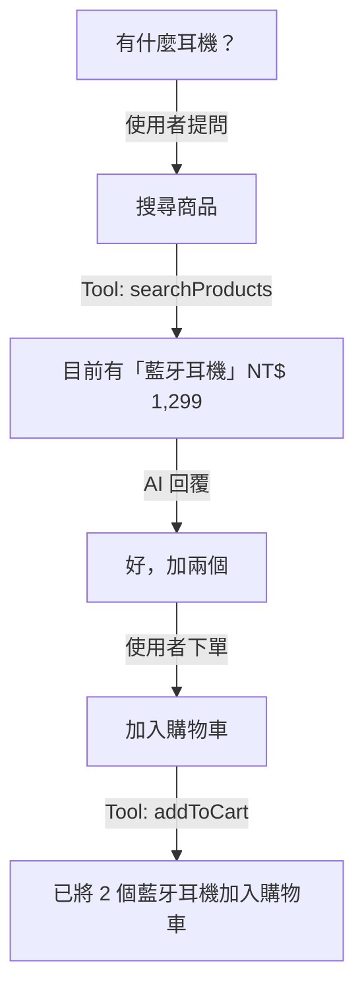
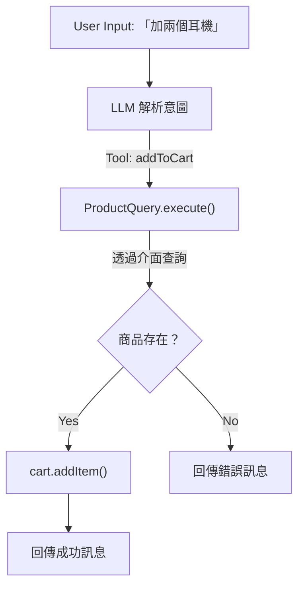

> 網路上 Clean Architecture 的文章很多，但大多停在理論層面。這篇透過一個 AI 電商聊天機器人的實作，展示怎麼在 TypeScript 中落地。

Clean Architecture 是 Uncle Bob 提出的架構模式，強調**關注點分離**跟**依賴反轉**。

聽起來很抽象對吧？我也是實際寫過一輪才比較有感覺，這篇就用實際程式碼來說明。

<Callout>
  **跟 DDD 的關係？** Clean Architecture 管「程式碼怎麼分層」，DDD
  管「業務邏輯怎麼建模」。兩個常搭配用，因為 Entity 層跟 DDD
  的領域層概念很像。這篇專注在分層，Entity 有點 DDD 的味道但沒嚴格照搬。
</Callout>

---

## 專案概覽

| 項目       | 內容                                                      |
| ---------- | --------------------------------------------------------- |
| **類型**   | AI 電商聊天機器人                                         |
| **技術棧** | Cloudflare Workers + Hono + Vercel AI SDK + TailwindCSS 4 |
| **功能**   | 透過自然語言搜尋商品、管理購物車                          |

使用者可以用對話方式購物：



就是這個功能——讓 AI 理解使用者意圖，透過 Tool Calling 操作購物車。

---

## 架構分層

Clean Architecture 的核心是**同心圓**，依賴方向永遠從外到內：

#### Frameworks & Drivers — Hono + Cloudflare Workers

- **index.tsx** — Hono 入口
- **client.tsx** — 前端元件
- **Cloudflare KV** — 儲存服務

#### Interface Adapters — Controller / Presenter / Repository

- **Controller** — HTTP 路由
- **Presenter** — SSE 輸出
- **Repository** — KV 存取
- **Agent** — LLM 整合

#### Application Layer — Use Cases + Interfaces

- **ChatWithAssistant** — 聊天流程編排
- **interface.ts** — 定義協作者介面

#### Enterprise Layer — Pure TypeScript

- **Cart** — 購物車 Entity
- **Product** — 商品 Entity
- **Conversation** — 對話 Entity

對應到專案目錄：

```plaintext title="src/"
├── entity/
│   ├── Cart.ts
│   ├── Product.ts
│   └── Conversation.ts
├── usecase/
│   ├── ChatWithAssistant.ts
│   └── interface.ts
├── controller/
│   └── ChatController.ts
├── presenter/
│   └── StreamingEventPresenter.ts
├── repository/
│   ├── KvCartRepository.ts
│   └── KvConversationRepository.ts
├── agent/
│   ├── LlmChatAgent.ts
│   └── CartTool.ts
└── view/
    ├── Chat.tsx
    └── ChatInput.tsx
```

接下來從最內層開始，一層一層往外看。

---

## Entity 層：純領域邏輯

Entity 是最內層，**完全不依賴任何框架**。

來看購物車怎麼寫：

```typescript title="entity/Cart.ts"
export class CartItem {
  public readonly name: string;
  public readonly price: number;
  public readonly quantity: number;

  constructor(name: string, price: number, quantity: number) {
    this.name = name;
    this.price = price;
    this.quantity = quantity;
  }

  get total(): number {
    return this.price * this.quantity;
  }

  updateQuantity(quantity: number): CartItem {
    return new CartItem(this.name, this.price, quantity);
  }
}

export class Cart {
  public readonly id: string;
  private _items: CartItem[] = [];
  private _isDirty = false;

  constructor(id: string) {
    this.id = id;
  }

  get isDirty(): boolean {
    return this._isDirty;
  }

  addItem(name: string, price: number, quantity: number): void {
    this._isDirty = true;
    // ... 業務邏輯
  }
}
```

幾個值得注意的地方：

1. **不可變模式**——`updateQuantity()` 回傳新物件，不改原本的
2. **髒標記**——`isDirty` 讓外層知道資料有沒有變，要不要刷新 UI
3. **零依賴**——整個檔案沒有 import 任何外部套件

重點是最後一項，哪天想把 Cloudflare Workers 換成 AWS Lambda？這層完全不用動。

---

## Use Case 層：介面定義 + 業務編排

Use Case 層做兩件事：**定義介面**跟**編排業務流程**。

<Tabs defaultValue="interface">
<TabsList>
<TabsTrigger value="interface">定義介面</TabsTrigger>
<TabsTrigger value="usecase">編排業務流程</TabsTrigger>
<TabsIndicator />
</TabsList>

<TabsContent value="interface">

Use Case **只定義需要什麼能力**，不管具體實作是用 KV、PostgreSQL 還是 MongoDB：

```typescript title="usecase/interface.ts"
export interface CartRepository {
  find(sessionId: SessionId): Promise<Cart>;
  save(cart: Cart): Promise<void>;
}

export interface ChatAgent {
  chat(cart: Cart, productQuery: ProductQuery, messages: Message[]): AsyncIterable<string>;
}

export interface StreamingEventPresenter {
  messagePartial(chunk: string): Promise<void>;
  refreshCart(): Promise<void>;
}
```

</TabsContent>

<TabsContent value="usecase">

這是整個應用最核心的 Use Case：

```typescript title="usecase/ChatWithAssistant.ts"
export class ChatWithAssistant {
  constructor(
    private readonly conversations: ConversationRepository,
    private readonly carts: CartRepository,
    private readonly productQuery: ProductQuery,
    private readonly presenter: StreamingEventPresenter,
    private readonly agent: ChatAgent,
  ) {}

  async execute(sessionId: string, content: string) {
    // 1. 載入資料
    const cart = await this.carts.find(sessionId);
    const conversation = await this.conversations.find(sessionId);
    conversation.addMessage(Role.User, content);

    // 2. 呼叫 AI 並串流輸出
    const reply = await this.agent.chat(cart, this.productQuery, conversation.messages);

    let assistantMessage = "";
    for await (const chunk of reply) {
      assistantMessage += chunk;
      await this.presenter.messagePartial(chunk);
    }
    conversation.addMessage(Role.Assistant, assistantMessage);

    // 3. 儲存資料
    await this.conversations.save(conversation);
    await this.carts.save(cart);

    // 4. 通知 UI 刷新購物車（如果有變更）
    if (cart.isDirty) {
      await this.presenter.refreshCart();
    }
  }
}
```

</TabsContent>

</Tabs>

看一下：

- 依賴全都是**介面**，不是具體 class
- 用 `AsyncIterable<string>` 做串流
- 靠 Entity 的 `isDirty` 決定要不要刷 UI

Use Case 只管「做什麼」，不管「怎麼做」，怎麼存、怎麼輸出、怎麼跟 LLM 溝通都是外層的事。

---

## Adapter 層：實作介面

介面定義完了，接下來看怎麼實作。

Adapter 層就是「橋接」Use Case 跟外部世界的地方，有三種角色：

<Steps>

<Step>Repository — 資料存取</Step>

負責把 Entity 轉成儲存格式，再從儲存還原成 Entity：

```typescript title="repository/KvCartRepository.ts"
@injectable()
export class KvCartRepository implements CartRepository {
  constructor(@inject(KvStore) private readonly kv: KVNamespace) {}

  async find(sessionId: SessionId): Promise<Cart> {
    const key = `cart:${sessionId}`;
    const data = await this.kv.get<CartSchema>(key, "json");
    if (!data) {
      return new Cart(sessionId);
    }
    const cart = new Cart(sessionId);
    for (const item of data.items) {
      cart.addItem(item.name, item.price, item.quantity);
    }
    return cart;
  }

  async save(cart: Cart): Promise<void> {
    const key = `cart:${cart.id}`;
    const schema: CartSchema = {
      id: cart.id,
      items: cart.items.map((item) => ({
        name: item.name,
        price: item.price,
        quantity: item.quantity,
      })),
    };
    await this.kv.put(key, JSON.stringify(schema), { expirationTtl: 3600 });
  }
}
```

<Step>Presenter — 輸出格式化</Step>

把輸出轉成特定格式，這邊用 SSE：

```typescript title="presenter/StreamingEventPresenter.ts"
export class HonoServerEventPresenter implements StreamingEventPresenter {
  constructor(private readonly stream: SSEStreamingApi) {}

  async messagePartial(chunk: string): Promise<void> {
    await this.stream.writeSSE({
      event: "message",
      data: JSON.stringify({ content: chunk }),
    });
  }

  async refreshCart(): Promise<void> {
    await this.stream.writeSSE({
      event: "refresh",
      data: JSON.stringify({}),
    });
  }
}
```

<Step>Agent — LLM 整合</Step>

這是這個專案比較特別的地方——**把 LLM 當成一種 Adapter**：

```typescript title="agent/LlmChatAgent.ts"
@injectable()
export class LlmChatAgent implements ChatAgent {
  constructor(@inject(LlmModel) private readonly model: LanguageModel) {}

  async *chat(cart: Cart, productQuery: ProductQuery, messages: Message[]): AsyncIterable<string> {
    const productTools = createProductTools(productQuery);
    const cartTools = createCartTools(cart, productQuery);

    const { textStream } = await streamText({
      model: this.model,
      system: "...",
      messages: messages,
      tools: { ...productTools, ...cartTools },
    });

    for await (const chunk of textStream) {
      yield chunk;
    }
  }
}
```

為什麼說特別？傳統 Clean Architecture 沒有「Agent」這東西，但 LLM 就是一種外部服務啊，用 Adapter 包起來很合理。

</Steps>

---

## LLM Tool Calling 設計

這專案比較有趣的地方——LLM 呼叫的工具也遵循 Clean Architecture。

先看流程：



對應到程式碼，以「加入購物車」為例：

```typescript title="agent/CartTool.ts"
export const createAddToCartTool = (cart: Cart, productQuery: ProductQuery) =>
  tool({
    description: "Add a product to the cart",
    parameters: z.object({
      name: z.string(),
      quantity: z.number().int().positive(),
    }),
    execute: async ({ name, quantity }) => {
      // 透過介面查詢商品
      const products = await productQuery.execute(name);
      const product = products.find((p) => p.name === name);

      if (!product) {
        return { success: false, message: `找不到商品 ${name}` };
      }

      // 直接操作 Entity
      cart.addItem(name, product.price, quantity);
      return { success: true, message: `已將 ${quantity} 個 ${name} 加入購物車` };
    },
  });
```

重點：

- Tool 透過 `ProductQuery` **介面**查商品，不是直接戳資料庫
- 直接操作傳進來的 `Cart` Entity
- 回傳結構化結果讓 LLM 知道成功沒

Tool 也是依賴介面，根本不知道商品資料從哪來。

---

## Controller：組裝依賴

Controller 是 **Composition Root**，負責組裝所有依賴：

```typescript title="controller/ChatController.ts"
const routes = app.post("/", zValidator("json", schema), async (c) => {
  return streamSSE(c, async (stream) => {
    const { sessionId, content } = c.req.valid("json");

    // 組裝所有依賴
    const conversations = container.resolve(KvConversationRepository);
    const carts = container.resolve(KvCartRepository);
    const productQuery = container.resolve(InlineProductQuery);
    const presenter = new HonoServerEventPresenter(stream);
    const agent = container.resolve(LlmChatAgent);

    // 建立 Use Case 並執行
    const chatWithAssistant = new ChatWithAssistant(
      conversations,
      carts,
      productQuery,
      presenter,
      agent,
    );

    await chatWithAssistant.execute(sessionId, content);
  });
});
```

這裡是唯一知道「誰實作了什麼介面」的地方。

---

## 測試策略

依賴介面的好處？測試超簡單，LLM 直接換成 Mock：

<Tabs defaultValue="test">
<TabsList>
<TabsTrigger value="test">測試案例</TabsTrigger>
<TabsTrigger value="mock">Mock 實作</TabsTrigger>
<TabsIndicator />
</TabsList>

<TabsContent value="test">

```typescript title="test/chat.spec.ts"
describe("POST /api/chat", () => {
  beforeEach((ctx) => {
    givenLanguageModel(ctx, [
      { type: "text-delta", textDelta: "Hello" },
      { type: "text-delta", textDelta: " World" },
      {
        type: "finish",
        finishReason: "stop",
        usage: { completionTokens: 0, promptTokens: 0 },
      },
    ]);
  });

  it("responds with SSE stream", async (ctx) => {
    const sessionId = "test-session";
    await whenSendChatMessage(ctx, sessionId, "Hello");

    await thenStreamEventHave(ctx, [
      "event: message",
      'data: {"content":"Hello"}',
      'data: {"content":" World"}',
    ]);
  });
});
```

</TabsContent>

<TabsContent value="mock">

```typescript title="test/steps/llm.ts"
export function givenLanguageModel(ctx: TestContext, chunks: LanguageModelV1StreamPart[]) {
  const model = new MockLanguageModelV1({
    doStream: async () => ({
      rawCall: { rawPrompt: null, rawSettings: {} },
      stream: simulateReadableStream({ chunks }),
    }),
  });

  container.register(LlmModel, { useValue: model });
}
```

</TabsContent>

</Tabs>

不用真的打 OpenAI API，就能跑完整個聊天流程的測試。

---

## 怎麼判斷「Clean」

回頭看這個專案，有沒有符合原則：

| Clean Architecture 原則     | 這個專案有做到嗎                    |
| --------------------------- | ----------------------------------- |
| **依賴規則**：外層依賴內層  | Controller → Use Case → Entity ✅   |
| **Entity 獨立**：無框架依賴 | `Cart`, `Product` 純 TypeScript ✅  |
| **Use Case 定義介面**       | `interface.ts` 定義所有協作者 ✅    |
| **依賴反轉**                | Use Case 不知道 KV、Hono、AI SDK ✅ |
| **可測試性**                | 可以輕鬆 Mock LLM 測試 ✅           |

---

## 實務上的取捨

當然沒有完美的架構，這專案也有妥協的地方：

| 項目                | 現況                      | 討論                             |
| ------------------- | ------------------------- | -------------------------------- |
| **Entity 可變性**   | `Cart` 有 `_isDirty` 狀態 | 嚴格派會說 Entity 應該完全不可變 |
| **Controller 組裝** | 在 Controller 裡組裝依賴  | 可以抽到獨立的 Composition Root  |
| **Agent 層**        | 獨立的 `src/agent/` 目錄  | 這算是創新——把 LLM 當 Adapter    |

<Callout>架構是拿來解決問題的，不是拿來追求完美的。適合團隊跟專案規模最重要。</Callout>

---

## 小結

三句話講完 Clean Architecture：

1. **依賴方向由外到內**——框架依賴業務邏輯，不能反過來
2. **Use Case 定義介面**——業務邏輯說「我要什麼」，外層說「我給你」
3. **Entity 零依賴**——核心規則不碰任何框架

寫完這專案的感想：一開始真的覺得很煩，介面寫一堆。但後來要把某個元件換掉的時候，改兩行就搞定，當初多寫的那些介面全都值了。

專案如果要長期維護，或是要串一堆外部服務（LLM、DB、第三方 API），花時間弄 Clean Architecture 是值得的。

---

## 參考資料

- [The Clean Architecture - Robert C. Martin](https://blog.cleancoder.com/uncle-bob/2012/08/13/the-clean-architecture.html)
- [Vercel AI SDK Documentation](https://sdk.vercel.ai/docs)
- [Hono Framework](https://hono.dev/)
