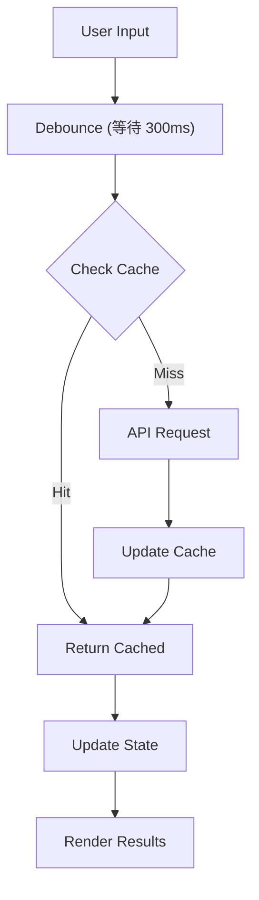

> Autocomplete 是前端系統設計面試中最常見的題目之一，被 Google、Meta、Apple、Uber 等大廠頻繁考察。本文將使用 **RADIO Pattern** 系統性地拆解這個問題。

## TL;DR

1. **先問需求** — 結果類型？裝置？離線？
2. **三層架構** — View → Controller (Hook) → Service (Cache + Network)
3. **關鍵優化** — Debounce 300ms、LRU Cache、Race Condition 處理
4. **別忘 A11y** — `role="combobox"`、`aria-expanded`、鍵盤導航

---

## 題目

Design an autocomplete UI component that allows users to enter a search term into a text box, a list of search results appear in a popup and the user can select a result.

**難度：Medium ~ Hard**

你可能在這些地方看過這個元件：

| 產品              | 特色                   | 結果類型    |
| ----------------- | ---------------------- | ----------- |
| **Google Search** | 即時搜尋建議、歷史紀錄 | 純文字      |
| **YouTube**       | 影片預覽縮圖           | 文字 + 圖片 |
| **Facebook**      | 好友、粉專、社團       | Rich Media  |
| **GitHub**        | Repo、Issue、User      | 混合類型    |


---

## RADIO Pattern 快速導覽

| 階段              | 核心問題           | 產出                |
| ----------------- | ------------------ | ------------------- |
| **R**equirements  | 要解決什麼問題？   | 功能清單、限制條件  |
| **A**rchitecture  | 系統長什麼樣？     | 架構圖、元件拆分    |
| **D**ata Model    | 資料怎麼流動？     | State、Cache、Props |
| **I**nterface     | 怎麼使用這個元件？ | API 設計、使用範例  |
| **O**ptimizations | 如何做得更好？     | 效能、UX、A11y      |

---

## R - Requirements（需求釐清）

### 面試時該問的問題

在開始設計之前，**主動向面試官確認需求**是展現專業的第一步：

| 問題                        | 為什麼重要     | 可能答案                      |
| --------------------------- | -------------- | ----------------------------- |
| 支援哪些結果類型？          | 影響 UI 複雜度 | 純文字 / Rich Media / 混合    |
| 目標裝置是？                | 影響互動設計   | Desktop only / 全裝置         |
| 需要離線支援嗎？            | 影響快取策略   | 是 / 否                       |
| 搜尋是 client 還是 server？ | 影響架構設計   | Server API / Client filtering |
| 需要模糊搜尋嗎？            | 影響實作複雜度 | 精確匹配 / Fuzzy match        |

### 需求分類

> **Functional Requirements（功能需求）**
>
> - 輸入文字時即時顯示搜尋建議
> - 支援鍵盤導航（↑↓ 選擇、Enter 確認、Esc 關閉）
> - 點擊選項後觸發回調
> - 支援自訂結果渲染

> **Non-Functional Requirements（非功能需求）**
>
> - **效能**：輸入到顯示結果 < 100ms
> - **無障礙**：符合 WCAG 2.1 AA 標準
> - **可擴展**：支援不同資料來源與 UI 樣式
> - **響應式**：適配各種螢幕尺寸

---

## A - Architecture（架構設計）

### 高層架構圖

#### View Layer — React Components

- **Input Field** — 使用者輸入
- **Dropdown List** — 搜尋結果
- **Loading State** — 載入狀態

#### Controller — useAutocomplete Hook

- **State Management** — query, results, isOpen
- **Event Handlers** — input, select, keydown
- **Debounce Logic** — 300ms 防抖

#### Service Layer — Cache + Network

- **CacheService** — LRU 快取
- **NetworkService** — API 請求

### 資料流（Data Flow）



### 元件職責分離

| 層級           | 元件            | 職責                 | 原則           |
| -------------- | --------------- | -------------------- | -------------- |
| **View**       | Input           | 接收輸入、顯示當前值 | 純展示，無邏輯 |
| **View**       | Dropdown        | 渲染搜尋結果列表     | 純展示，無邏輯 |
| **Controller** | useAutocomplete | 狀態管理、事件處理   | 業務邏輯集中   |
| **Service**    | CacheService    | 快取讀寫、淘汰策略   | 可替換實作     |
| **Service**    | NetworkService  | API 請求、錯誤處理   | 可替換實作     |

---

## D - Data Model（資料模型）

### State 設計

```typescript
interface AutocompleteState<T> {
  // 輸入相關
  query: string;

  // 結果相關
  results: T[];
  isLoading: boolean;
  error: Error | null;

  // UI 相關
  isOpen: boolean;
  highlightedIndex: number;
}

// 初始狀態
const initialState: AutocompleteState<unknown> = {
  query: "",
  results: [],
  isLoading: false,
  error: null,
  isOpen: false,
  highlightedIndex: -1,
};
```

### Cache 設計

> **為什麼需要 Cache？**
>
> 1. 減少重複的 API 請求（使用者常會刪除再重打）
> 2. 提升回應速度（cache hit 可達 < 1ms）
> 3. 減輕 server 負擔

```typescript
interface CacheEntry<T> {
  data: T[];
  timestamp: number;
  expiresAt: number;
}

interface CacheConfig {
  maxSize: number; // 最大快取數量，建議 50-100
  ttl: number; // Time to live (ms)，建議 5 分鐘
  strategy: "lru" | "fifo"; // 淘汰策略，建議 LRU
}
```

**LRU vs FIFO 選擇：**

| 策略     | 優點         | 缺點           | 適用場景   |
| -------- | ------------ | -------------- | ---------- |
| **LRU**  | 保留熱門查詢 | 實作較複雜     | 大多數情況 |
| **FIFO** | 實作簡單     | 可能淘汰熱門項 | 簡單場景   |

### Props Interface

```typescript
interface AutocompleteProps<T> {
  // === 核心功能 ===
  fetchSuggestions: (query: string) => Promise<T[]>;
  onSelect?: (item: T) => void;

  // === 受控模式（可選）===
  value?: string;
  onChange?: (value: string) => void;

  // === 行為配置 ===
  debounceMs?: number; // default: 300
  minQueryLength?: number; // default: 1
  maxResults?: number; // default: 10

  // === 自訂渲染（Render Props Pattern）===
  renderItem?: (item: T, highlighted: boolean) => ReactNode;
  renderEmpty?: () => ReactNode;
  renderLoading?: () => ReactNode;

  // === 無障礙 ===
  id?: string;
  ariaLabel?: string;
  placeholder?: string;
}
```

---

## I - Interface（介面設計）

### Component API 使用範例

**基本使用：**

```tsx
<Autocomplete
  fetchSuggestions={async (query) => {
    const res = await fetch(`/api/search?q=${query}`);
    return res.json();
  }}
  onSelect={(item) => console.log("Selected:", item)}
  placeholder="Search..."
/>
```

**完整配置：**

```tsx
interface User {
  id: string;
  name: string;
  avatar: string;
  email: string;
}

<Autocomplete<User>
  // 核心
  fetchSuggestions={searchUsers}
  onSelect={(user) => router.push(`/users/${user.id}`)}
  // 行為
  debounceMs={300}
  minQueryLength={2}
  maxResults={8}
  // 自訂渲染
  renderItem={(user, highlighted) => (
    <div className={cn("flex items-center gap-3 p-2", highlighted && "bg-blue-50")}>
      
      <div>
        <p className="font-medium">{user.name}</p>
        <p className="text-sm text-gray-500">{user.email}</p>
      </div>
    </div>
  )}
  renderEmpty={() => <p className="p-4 text-center text-gray-500">No users found</p>}
  // 無障礙
  id="user-search"
  ariaLabel="Search for users"
  placeholder="Type a name..."
/>;
```

### Server API 設計

```typescript
// GET /api/search?q={query}&limit={limit}&offset={offset}

// Request Query Params
interface SearchParams {
  q: string; // 搜尋關鍵字
  limit?: number; // 每頁數量，default: 10
  offset?: number; // 分頁偏移，default: 0
}

// Response
interface SearchResponse<T> {
  results: T[];
  total: number;
  hasMore: boolean;
}

// Error Response
interface ErrorResponse {
  error: string;
  code: "INVALID_QUERY" | "RATE_LIMITED" | "SERVER_ERROR";
}
```

---

## O - Optimizations（優化策略）

### 1. Debounce（防抖）

> **問題**：每次按鍵都發送 API 請求會造成伺服器負擔過重、網路資源浪費、Race condition 風險。

**核心概念：** 等待使用者停止輸入一段時間後才觸發搜尋。

```typescript
// 簡化版 - 實務上可用 lodash.debounce 或 use-debounce
const debouncedSearch = useDebouncedCallback((query: string) => {
  fetchSuggestions(query);
}, 300);
```

| 裝置    | 建議延遲  | 原因             |
| ------- | --------- | ---------------- |
| Desktop | 300ms     | 打字快，短延遲   |
| Mobile  | 400-500ms | 虛擬鍵盤打字較慢 |

### 2. Race Condition 處理

> **問題**：使用者快速輸入 "react" → "redux"，如果 "react" 的請求比較慢，可能會覆蓋 "redux" 的結果。

**兩種解法：**

| 方法                | 優點             | 缺點           |
| ------------------- | ---------------- | -------------- |
| **Request ID**      | 簡單、不依賴 API | 舊請求仍會完成 |
| **AbortController** | 真正取消請求     | 需要 API 支援  |

```typescript
// 方法一：Request ID - 只用最新請求的結果
const requestId = useRef(0);

async function search(query: string) {
  const currentId = ++requestId.current;
  const result = await fetchSuggestions(query);

  // 丟棄過期的結果
  if (currentId !== requestId.current) return;

  setResults(result);
}
```

```typescript
// 方法二：AbortController - 取消前一個請求
const controllerRef = useRef<AbortController>();

async function search(query: string) {
  controllerRef.current?.abort(); // 取消前一個
  controllerRef.current = new AbortController();

  const result = await fetch(`/api/search?q=${query}`, {
    signal: controllerRef.current.signal,
  });
}
```

### 3. LRU Cache

> **為什麼用 LRU？** 保留最近使用的查詢，刪除最久沒用的。使用者常會刪除再重打，cache 可大幅提升體驗。

**核心邏輯：**

```typescript
class LRUCache<T> {
  private cache = new Map<string, { data: T[]; expiresAt: number }>();

  get(key: string): T[] | null {
    const entry = this.cache.get(key);
    if (!entry || Date.now() > entry.expiresAt) return null;

    // LRU 關鍵：移到最後（最新）
    this.cache.delete(key);
    this.cache.set(key, entry);
    return entry.data;
  }

  set(key: string, data: T[]): void {
    // 超過容量，刪除第一個（最舊）
    if (this.cache.size >= 100) {
      const oldest = this.cache.keys().next().value;
      this.cache.delete(oldest);
    }
    this.cache.set(key, { data, expiresAt: Date.now() + 5 * 60 * 1000 });
  }
}
```

**建議配置：** `maxSize: 50-100`、`TTL: 5 分鐘`

### 4. Keyboard Navigation

| 按鍵          | 行為               |
| ------------- | ------------------ |
| `↓` ArrowDown | 高亮下一個選項     |
| `↑` ArrowUp   | 高亮上一個選項     |
| `Enter`       | 選擇當前高亮項     |
| `Escape`      | 關閉下拉選單       |
| `Tab`         | 移到下一個表單元素 |

```typescript
function handleKeyDown(e: KeyboardEvent) {
  switch (e.key) {
    case "ArrowDown":
      e.preventDefault();
      setHighlightedIndex((prev) => Math.min(prev + 1, results.length - 1));
      break;
    case "ArrowUp":
      e.preventDefault();
      setHighlightedIndex((prev) => Math.max(prev - 1, 0));
      break;
    case "Enter":
      if (highlightedIndex >= 0) onSelect(results[highlightedIndex]);
      break;
    case "Escape":
      setIsOpen(false);
      break;
  }
}
```

### 5. Accessibility（無障礙）

> **為什麼重要？** 法規要求（ADA、WCAG）、提升使用者體驗、SEO 加分。

**必要的 ARIA 屬性：**

| 元素      | 屬性                       | 說明            |
| --------- | -------------------------- | --------------- |
| Container | `role="combobox"`          | 標識元件類型    |
| Container | `aria-expanded`            | 選單是否展開    |
| Input     | `aria-autocomplete="list"` | 有自動完成列表  |
| Input     | `aria-activedescendant`    | 當前高亮選項 ID |
| List      | `role="listbox"`           | 標識列表        |
| Option    | `role="option"`            | 標識選項        |
| Option    | `aria-selected`            | 是否被選中      |

```tsx
<div role="combobox" aria-expanded={isOpen} aria-haspopup="listbox">
  <input
    aria-autocomplete="list"
    aria-activedescendant={highlightedIndex >= 0 ? `option-${highlightedIndex}` : undefined}
  />
  <ul role="listbox">
    {results.map((item, i) => (
      <li key={i} id={`option-${i}`} role="option" aria-selected={i === highlightedIndex}>
        {item.name}
      </li>
    ))}
  </ul>
</div>
```

---

## Deep Dive：常見追問

> 面試官可能會追問這些進階問題，準備好簡短的回答。

### Q1: 如何處理大量搜尋結果？

**答：Virtual Scrolling** — 只渲染可視區域的 DOM，使用 `@tanstack/react-virtual` 或 `react-window`。

### Q2: 如何實作 Highlight Matching Text？

```tsx
function highlightMatch(text: string, query: string) {
  const escaped = query.replace(/[.*+?^${}()|[\]\\]/g, "\\$&");
  const parts = text.split(new RegExp(`(${escaped})`, "gi"));
  return parts.map((part, i) =>
    part.toLowerCase() === query.toLowerCase() ? <mark key={i}>{part}</mark> : part,
  );
}
// highlightMatch("TypeScript", "type") → <mark>Type</mark>Script
```

### Q3: 如何處理網路錯誤？

**答：Retry with Exponential Backoff** — 失敗後等待 1s、2s、4s... 重試，最多 3 次。也可以 fallback 到 cache 資料。

### Q4: Mobile 有什麼特殊考量？

| 考量         | 解法                         |
| ------------ | ---------------------------- |
| 虛擬鍵盤遮擋 | 調整 dropdown 位置或用 modal |
| 點擊區域太小 | 增加 padding，至少 44x44px   |
| 打字較慢     | 增加 debounce 到 400-500ms   |

---

## 總結

使用 RADIO Pattern 設計 Autocomplete，我們系統性地處理了：

| 階段                | 關鍵產出                                  |
| ------------------- | ----------------------------------------- |
| **R** Requirements  | 功能/非功能需求清單、面試提問技巧         |
| **A** Architecture  | 三層架構圖、資料流設計、職責分離          |
| **D** Data Model    | State 結構、Cache 策略、Props Interface   |
| **I** Interface     | Component API、Server API 設計            |
| **O** Optimizations | Debounce、Race Condition、LRU Cache、A11y |

> **面試技巧提醒**
>
> 1. **先問再答** — 展現需求分析能力
> 2. **畫圖說明** — 架構圖比程式碼更有說服力
> 3. **說明 Why** — 不只說做什麼，還要說為什麼
> 4. **提出 Trade-offs** — 沒有完美方案，只有適合的方案
> 5. **考慮邊界情況** — 空結果、錯誤處理、大量資料

## 延伸閱讀

- [WAI-ARIA Combobox Pattern](https://www.w3.org/WAI/ARIA/apg/patterns/combobox/)
- [React ARIA useComboBox](https://react-spectrum.adobe.com/react-aria/useComboBox.html)
- [Downshift - Primitive to build flexible autocomplete](https://www.downshift-js.com/)
- [TanStack Virtual - Virtualize large lists](https://tanstack.com/virtual/latest)
