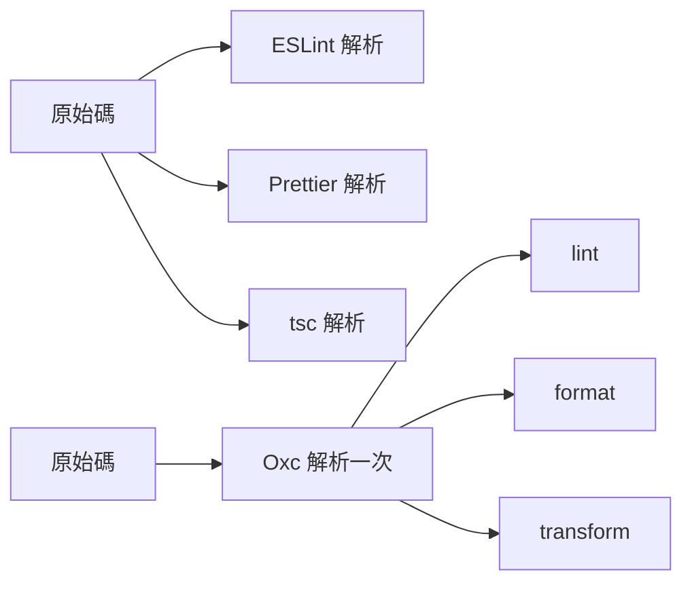
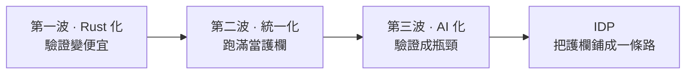

前陣子有兩樁收購案，如果你有在看前端工具鏈的消息，大概會愣一下。

六月初，Cloudflare 把 VoidZero 買下來，那是尤雨溪專門做下一代前端工具鏈的公司。

再早半年，2025 年底，做 Claude 的那家 AI 公司 Anthropic，把 Bun 收了。

以前這種東西是不會被收購的。

前端的打包器、linter、執行環境，過去就是一個個開源專案，作者用愛發電，頂多接受一點贊助，但現在平台級的公司開始花錢搶，而且半年內就兩樁。

我想講的不是收購本身，是它們指向的同一件事，前端的地基正在洗牌，而且方向出奇地一致。

要看懂這張新地圖，其實只需要一個框架，前端 Infra 從頭到尾都在解決兩件事，一是重複，把每次都要做、又容易漏的事交給機器，二是錯誤，在問題進到正式環境之前先擋下來。

| 兩條軸     | 在做的事       | 這些年的變化                   |
| ---------- | -------------- | ------------------------------ |
| **重複性** | 自動化重複勞動 | 幾十年沒變                     |
| **錯誤**   | 攔截錯誤       | 從攔「人」到攔「AI」，正在反轉 |

記住這兩條就好，因為接下來你會發現，其中一條幾十年沒變過，另一條，正在我們眼前反轉。

> Infra 一直在做兩件事：自動化重複、攔截錯誤。重複那件沒變，變的是我們從攔「人」的錯，變成攔「AI」的錯，而 AI 的錯，多到只有機器攔得住。

這篇就想把這條反轉講清楚，順著三波浪潮，看它怎麼一步步把「驗證」推成 2026 的新戰場。

---

## 第一波：Rust 化，重點不是快，是便宜

過去一兩年，你大概聽過 Oxlint、Rolldown、Vite 8 這些名字，它們表面上各做各的，底層卻有一個共同點，都改用 Rust 重寫，不再是 JavaScript。

把它們攤開，會發現這一波其實是一場全面的世代交替，一個舊的 JS 工具，對上一個新的 Rust 工具。

| 舊工具（JS）     | 新工具（Rust）  | 做的事 |
| ---------------- | --------------- | ------ |
| ESLint           | Oxlint          | 檢查   |
| Prettier         | Oxfmt           | 格式化 |
| esbuild / Rollup | Rolldown        | 打包   |
| Babel            | Oxc transformer | 轉譯   |

第一個感受是快得誇張，[Vite 8 官方](https://vite.dev/blog/announcing-vite8)說把預設打包器換成 Rolldown 之後，生產環境的 build 比 Rollup 快了十到三十倍。

而且這不是實驗室裡的漂亮數字，Linear 的 build 從 46 秒掉到 6 秒，Ramp、Mercedes-Benz、Beehiiv 這些團隊也都回報三到六成的縮短。

<FramedImage
  src="/images/blog/notes-2026-frontend-infra-map/vite8-real-world-perf.webp"
  alt="Vite 8 官方公告的 Real-world performance:Linear 46s→6s、Ramp 57%、Mercedes-Benz 38%、Beehiiv 64% 的 build time 縮短"
/>

上圖是 [Vite 8 官方公告](https://vite.dev/blog/announcing-vite8)列出的實測數字，同一頁也提到用 Oxc 的語意分析幫 Rolldown 做更準的 tree-shaking。

但如果你只看到「快」，就錯過了真正重要的那件事。

真正的轉變不是速度，是成本。

這裡值得停下來問一句，為什麼換成 Rust 就能快這麼多，答案不只是「編譯語言比較快」這麼簡單。

一部分原因在語言本身，Rust 沒有垃圾回收造成的停頓，記憶體用量可預測，又能吃滿多核平行，這些是 JavaScript 先天做不到的，但更關鍵的一部分，在架構。

以前你的專案裡，ESLint 解析一次程式碼、Prettier 再解析一次、tsc 又解析一次，同一份檔案被拆成語法樹拆了三四遍，每個工具都在重造輪子，Oxc 這類工具反過來，讓 parser、linter、formatter、transformer 共用同一套解析與語意分析，一份 code 只拆一次，大家接著用，省下來的就是那幾十倍。



上排是舊世代，同一份 code 被 parse 三遍，下排是 Oxc，只 parse 一次、後面三個工具共用同一份結果。

所以「快」只是表面，底下真正發生的是，跑一次完整驗證的成本崩跌了。

以前跑一輪完整的 lint、type check、build，是要精打細算的，吃 CPU、吃時間、吃 CI 費用，算力在過去是稀缺資源，所以每一次驗證都得掂量值不值得，而當一次 lint 從一兩分鐘掉到幾百毫秒，事情就變了，你可以在每次存檔、每個 commit、每個 PR 都跑一遍，卻完全不心痛。

於是一個平常被成本壓著、根本沒機會問的問題，浮出來了。

<Callout title="整場的引擎問句">

省下的算力，你要拿去「省錢」，還是拿去「驗證更多」？

</Callout>

把這個問題記著，它是理解後面兩波的引擎。

不過我得老實補一句，這一波還在路上。

<Callout title="現實檢查：方向確定，但還沒到終點">

日本團隊 ANDPAD 把這些工具真的[放進生產環境用過](https://speakerdeck.com/andpad/vue-nuxt-oxc-in-production)，結論是格式化工具 Oxfmt 可以現在就換掉 Prettier、一點問題都沒有，但 linter 那支 Oxlint 還沒辦法完全取代 ESLint，尤其 Vue 的 `.vue` 單檔元件還吃不太下，所以務實的做法是格式化先換、檢查混著用。

</Callout>

方向很確定，但你不用今天就全部換掉。

在進第二波之前，先埋一個之後會用到的伏筆，這些 Rust 工具除了快，還能更精準地做 tree-shaking，把沒用到的程式碼搖掉。

但有個東西會擋住它，叫循環相依，當 A 依賴 B、B 又回頭依賴 A，模組的邊界跟副作用就變得難以靜態判定，工具沒把握「刪了會不會出事」，只好保守地留著。

結論很簡單，結構越乾淨，機器越幫得上忙，這句話在第三波會變得關鍵。

---

## 第二波：統一化，CI 從「省」變成「守」

2023 年，我朋友 Kyle 寫過一篇很多人轉的文章《成為前端建築師吧》，裡面有一張圖，是他幫專案建 infra 時要親手接的工具。

```plaintext title="2023：一個專案的前端工具鏈"
ESLint           # 檢查
Prettier         # 格式化
husky            # git hooks
lint-staged      # 只檢查改動的檔案
Renovate         # 依賴更新
bundle analyzer  # 打包體積分析
madge            # 循環相依偵測
Knip             # 找出沒用到的檔案 / 匯出
…                # 還有十幾個
```

每一個都要單獨裝、單獨設定、單獨維護，還要想辦法讓它們彼此相容，光是把這堆黏在一起、又不打架，就是一份全職工作。

那就是當年前端 Infra 的樣子，一堆工具各自為政，你自己當膠水。

Vite+ 團隊的 [naokihaba](https://speakerdeck.com/naokihaba/vite-plus-unified-toolchain-for-the-web) 講過一句很到位的話，在做出產品之前，我們其實一直在做的，是工具鏈。

2026 的答案是統一化，把這十幾個工具收斂成一套，被 Cloudflare 收購的 [VoidZero](https://viteplus.dev/) 做的就是這件事，我自己在用的 vite-plus 也是，它把 Node 版本、套件管理器、加上打包測試檢查那一整套，全部收進一個 `vp` 指令底下。

<FramedImage
  src="/images/blog/notes-2026-frontend-infra-map/viteplus-landing.webp"
  alt="Vite+ 官網：用一個 vp 指令管理 runtime、套件管理器與前端工具鏈"
/>

上圖是 [Vite+ 官網](https://viteplus.dev/)，一個 `vp` 指令從 `create`、`dev`、`check`、`test` 到 `build` 一條龍。

而它管的不只是工具，還有整個環境，你 `vp create` 的當下，它就順手鎖好這個專案要用哪個版本的 Node、哪個套件管理器，於是「在我機器上會動、在你機器上壞掉」這種經典災難有機會直接消失，本機跑 `vp check`、CI 也跑 `vp check`，兩邊是同一組指令、同一套版本。

它現在還是 beta、開源免費，但別小看這個階段，[VoidZero 官方的六月回顧](https://voidzero.dev/posts/whats-new-jun-2026)提到，自 alpha 以來已經合併五百多個 PR、修了一百八十幾個問題，而且已經有超過一千三百個公開專案在用它。

<FramedImage
  src="/images/blog/notes-2026-frontend-infra-map/voidzero-recap-beta.webp"
  alt="VoidZero 官方回顧：Vite+ 進入 beta，超過 1300 個專案採用，並用 Vite+ 自己 build Vite+"
/>

上圖是 VoidZero 官方回顧，Vite+ 進入 beta、一千三百多個專案採用，連 Vite+ 自己都改用 Vite+ 來 build。

而且這不是一座孤島，連框架都在往同一個方向靠，Astro 7 已經內建 Vite 8，Nuxt 4 的下一個小版本也要跟上，甚至冒出一個叫 Vinext 的 Next 相容框架，底層走的也是 Vite。

整個生態在收斂，不是某個小圈子的偏好。

但統一化真正有意思的地方，不在「少打幾個指令」，在一個哲學上的反轉。

拿 NX 來對照最清楚，NX 有個招牌功能叫 affected，它會建一張專案的相依圖，算出這次改動只影響哪些部分，然後只跑那些，其他直接跳過，為什麼要跳過？因為省，在算力昂貴的年代，能少跑一點就少跑一點。

vite-plus 的做法剛好相反，它全部都跑，只是靠快取，讓沒改過的部分瞬間完成。

這兩種做法的差別，不只是速度，更是正確性，affected 的正確性建立在「那張圖是對的」這個前提上，可是隱性相依、設定檔漂移、跨專案的副作用，都可能讓圖算漏，一旦算漏，該跑的檢查就被悄悄跳過，而你不會知道。

全部跑加上內容快取剛好相反，它的快取金鑰是輸入檔案、設定、工具版本一起算出來的雜湊，內容一樣就命中、直接取結果，任何一點不一樣就重跑，所以它不會因為圖算錯而漏掉該驗證的東西，它只是把「沒變的東西」變便宜，而不是「賭它沒事」而跳過。

這不是空談。

VoidZero 那篇回顧裡就有一個很妙的例子，Vite+ 這個專案本身現在就是用 Vite+ 來 build 的，光靠快取，整條 pipeline 就少了大約一成的時間。

工具自己就在示範這套哲學，不是靠賭「跳過」省，而是靠「全部跑加上快取」，既快又完整。

你看出這裡發生什麼了嗎？這正是第一波那個引擎問句的答案，算力貴的時候，我們用 skip 來省錢，算力便宜之後，我們寧可全部跑一遍，把 CI 當成一整片沒有缺口的護欄。

> CI 的哲學，從「少跑、省錢」，變成了「跑滿、當護欄」。

順帶一提，統一化也還在默默解決那條沒變的重複軸。

pnpm 為什麼又快又省，是因為它用 symlink 把每個套件指向硬碟上同一份內容，而不是每個專案各複製一份，一百個專案用到同一個版本的 lodash，硬碟上也只存一份。

消滅重複，這條老軸幾十年如一日。

而 CI 從「省」變成「守」，其實是錯誤軸第一次真正被機器頂起來的徵兆，它為什麼偏偏在這個時間點變成剛需，第三波才是答案。

---

## 第三波：AI 化，驗證變成戰場

前兩波合起來，其實是把「工具」這件事解決掉了，我們現在手上，有一套又快、又便宜、又整合的護欄機器。

但工具只是手段。

護欄機器造好了，真正的問題是，這套護欄，現在要拿去攔誰的錯？

回到最開頭那句伏筆，2023 年，Infra 攔的是人的錯，2026 年，Infra 要攔的，是 AI 的錯。

這不是換個名詞而已，因為 AI 的錯跟人的錯，性質完全不同。

|          | 人的錯         | AI 的錯                    |
| -------- | -------------- | -------------------------- |
| **量**   | 涓涓細流       | 洪水                       |
| **長相** | 一看就怪       | 看起來都對，跑起來甚至沒事 |
| **來源** | 你寫的，有直覺 | 不是你寫的，沒有直覺       |

舉一個具體的例子你就懂了，你請 coding agent 加一個新頁面，它很聰明，看到專案別的地方有一段權限判斷，就複製了一份過來用，PR 編譯過、測試綠、畫面也對，你 review 時看不出任何問題，於是合併。

半年後，產品要改權限規則，你改了原本那一處，卻忘了還有一份被複製出去的副本，於是那個新頁面，就變成一個沒人記得的安全漏洞。

這種錯不只一種樣子，AI 也很會把某條業務規則直接寫死在畫面元件裡，繞過你們原本集中管理的地方，或是為了讓功能快點跑起來，悄悄改掉既有的快取策略，這些每一個單看都合理，合起來卻在慢慢啃食系統的一致性。

它們有一個共同的結構特徵，同一條規則出現了兩個來源、或是規則被放到了不該放的位置，而這種特徵，人用肉眼 review 幾乎抓不到，一條寫得夠好的 lint 規則卻攔得住。

把這三點加起來，量大、看起來都對、你又沒寫過，結論很殘酷，人用肉眼 review，根本接不住。

唯一的解法，是讓自動化的護欄頂上去，那些 lint、型別檢查、測試、CI，通通變成攔截 AI 錯誤的關卡，而且因為要攔的東西太多、太雜，你不能每個專案各自造一套，你得把整套護欄做成一個平台，讓每個開發者開箱就能用。

這個東西業界有個名字，叫 IDP，Internal Developer Platform，講白話就是把所有護欄鋪成一條路，你走在上面，該檢查的自動檢查、該擋的自動擋，不用自己架、也不用開單等平台團隊，你自己就能安全地把東西送出去。

這件事，工程師 Fortes Huang 有一篇[談 AI 導入工程團隊的文章](https://hackmd.io/@FortesHuang/HJnWgQGJMx)講得很透，他把團隊的能力拆成三層，產出的能力、審查的能力、還有確認它到底對不對的能力。

| 能力           | 做的事                       | AI 導入後  |
| -------------- | ---------------------------- | ---------- |
| **Production** | 產出 code、設計、測試        | 快速暴衝   |
| **Review**     | 判斷架構有沒有被破壞         | 壓力上升   |
| **Validation** | 確認產品語意、風險邊界對不對 | 成為新瓶頸 |

觀察很簡單，AI 一進來，最上面那層產出瞬間暴衝，但下面兩層審查跟確認沒跟上，於是瓶頸整個往下擠，卡在最後那層，驗證。

他還點出一個更狠的轉變，責任的重心，正從「誰把 code 寫出來」，移到「誰能確認它是對的」。

那驗證這一層要怎麼補，他給的方向裡有兩件事跟 infra 直接相關。

一是把 review 從「逐行看 code」改成「守系統邊界」，機器負責抓低階問題，人力集中判斷架構有沒有被打破。

二是把高風險、容易回歸壞掉的流程交給測試基礎建設守門，而且 E2E 要用風險排序、不是用數量，多產一倍測試不等於信心多一倍，測到最貴、最怕壞的那條路徑才算數。

這裡還有一個容易被忽略的細節，當那段 code 不是你寫的，護欄光會跳「過」或「不過」是不夠的，它得讓你看得見錯在哪、機器根據什麼規則判定、建議怎麼改，你才修得動、也才敢放手讓它擋，所以這條鋪好的路不能是黑盒，它本身要是透明、可解釋的。

這不是空想，連 Oxc 的 Oxlint 都刻意把診斷結果設計成 AI 讀得懂的結構化輸出，精確的錯誤位置、上下文、還附上對應的規則文件連結，讓 AI 在寫 code 的當下就能把 linter 當護欄、邊寫邊修，工具鏈自己，已經在為「攔 AI」而改造了。

到這裡，三波就扣成一條鏈了。

還記得第一波那句嗎，結構乾淨機器才幫得上忙，就是這裡，因為 Rust 讓驗證變得夠便宜，我們才負擔得起一直驗證、大量驗證，才接得住 AI 噴出來的洪水。

便宜讓跑滿成為可能，跑滿讓我們接得住 AI。



而且逼我們「驗證更多」的力量，還不只 AI。

2025 到 2026 年，JavaScript 生態被一隻叫 Shai-Hulud 的供應鏈蠕蟲掃過，光第一波就攻陷了超過五百個套件，而且它會自我複製、一路往下游擴散。

同一時間，歐盟通過了網路韌性法案 CRA，從外部要求軟體供應鏈必須可被驗證。

內有 AI、外有真實攻擊與法規，全指向同一個方向，這不是一時的 AI 炒作，是結構性的轉變。

---

## 那你現在能做什麼

講了三波趨勢，最後我想給還在寫 feature 的你，幾個明天就能動手的起點，不用一次到位。

<Steps>

<Step>

**先換掉格式化**

把格式化從 Prettier 換成 Oxfmt，它幾乎零成本、又幾乎完全相容，先讓團隊實際感受一次「快到你根本不在意它跑了幾遍」。

</Step>

<Step>

**把痛點寫成規則**

把你們團隊踩過最痛的那個「只有你們才懂的錯」，寫成一條 lint 規則，這正是通用工具永遠攔不到、但 AI 幾乎一定會犯的那種錯。

</Step>

<Step>

**讓 CI 從「省」變「守」**

重新看你的 CI，如果它還在為了省時間而跳過檢查，試著反過來，全部都跑、靠快取加速，把它從一個省錢工具，變成一片沒有缺口的護欄。

</Step>

<Step>

**重新看待護欄**

最後一步不用寫任何 code，就是換一個角度看那些擋你的檢查，它們不是來找你麻煩的，它們是你敢把一半的 code 交給 AI 的唯一理由。

</Step>

</Steps>

---

## 回到那張地圖

繞了一圈，其實就一張地圖、一句話。

那張地圖，是兩條座標軸，重複，跟錯誤。

重複那條幾十年沒變，也是你本來就懂的，真正在反轉的是錯誤那條，從攔人的錯，變成攔 AI 的錯。

而 Rust 化、統一化、AI 化這三波，只是同一條反轉，在不同層次上的展開。

如果你覺得這只是我一個人的分類，State of JS 2025 的數據其實給了佐證，Rust 底層的 Rolldown 一年內從 1% 用量跳到 10%，而受訪者寫出的 code 有將近三成是 AI 生成的、比前一年多了快一半，Rust 化跟 AI 化這兩波，數據上都真的在發生。

<FramedImage
  src="/images/blog/notes-2026-frontend-infra-map/stateofjs-2025-rolldown.webp"
  alt="State of JS 2025 把 Rolldown 列為年度亮點:Vite 團隊悄悄做的 Rust bundler,如今 Vite 自己也用它,興趣度排第一"
/>

上圖是 [State of JS 2025](https://2025.stateofjs.com/en-US/libraries/build-tools/) 把 Rolldown 選為年度亮點的段落。

所以對還在專心寫 feature 的人，我想留下一個重新框過的觀念，那些 lint、測試、CI，在 AI 時代不是來擋你麻煩的，它們是讓你敢相信「AI 幫你寫的那半段 code」的唯一理由，你能放心讓 AI 幫你加速，正是因為背後這條鋪好的路，接得住它的錯。

> 寫得快不是交付快，能安全地確認它是對的，才是交付快。

回到開頭那兩樁收購，平台級的公司花錢搶前端工具鏈，不是因為打包器本身多值錢，而是因為在 AI 時代，誰掌握了「驗證」，誰就掌握了下一個十年的地基。

這套框架，我自己已經在工作裡實作了幾個，用 Rust 做內部平台、寫 domain 專屬的 linter、做後端驅動的程式碼生成，那些，留到下一篇再聊。
