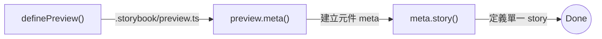
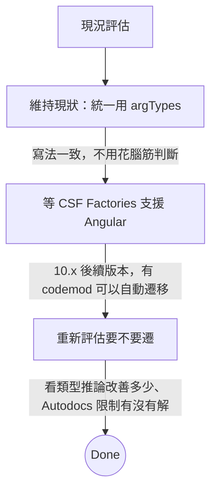

> 原本只是想研究怎麼讓 Storybook 自動產生文件，結果發現了 CSF Factories 這個新東西，看起來很香，但 Angular 專案現在還不能用。

## 起因

專案裡有 100 多個 UI 元件，每個都要寫 Storybook stories，最煩的是：

- `argTypes` 要手寫，寫到懷疑人生
- 類型定義又臭又長（`satisfies Meta<typeof Button>`）
- IDE 自動完成幾乎沒用

所以想研究 Autodocs 能不能自動產生這些東西，結果一查，發現 Storybook 10 推出了 **CSF Factories**，說是可以解決這些痛點。

---

## CSF 是什麼

先快速回顧一下 CSF（Component Story Format）的演進：

| 版本          | 年份 | 特色                          |
| ------------- | ---- | ----------------------------- |
| CSF 1         | 2019 | 基本的 ES Module 寫法         |
| CSF 2         | 2020 | 有了 Args、Template           |
| CSF 3         | 2022 | Object-based，多了 StoryObj   |
| CSF Factories | 2025 | Factory pattern，類型自動推論 |

### CSF 3 的痛點

現在大家用的 CSF 3 長這樣：

```typescript
import type { Meta, StoryObj } from "@storybook/react";
import { Button } from "./Button";

const meta = {
  component: Button,
} satisfies Meta<typeof Button>;

export default meta;

type Story = StoryObj<typeof meta>; // 每個檔案都要寫這行

export const Primary: Story = {
  args: { primary: true, label: "Button" },
};
```

問題在哪？

1. `satisfies Meta<typeof Button>` 每次都要寫
2. `type Story = StoryObj<typeof meta>` 每個檔案都要
3. IDE 的自動完成很弱，常常要自己查文件

據說 80% 的 Storybook 專案用 TypeScript，但這種開發體驗實在不太行。

---

## CSF Factories 長怎樣

核心概念是 **Factory Chain**，每一步都會自動推論類型，不用再手動標註，類似 Vite 的 `defineConfig`。



### 三個主要函式

| Function          | 幹嘛用的    | 放哪裡                  |
| ----------------- | ----------- | ----------------------- |
| `definePreview()` | 全域設定    | `.storybook/preview.ts` |
| `preview.meta()`  | 元件的 meta | `*.stories.ts`          |
| `meta.story()`    | 單一 story  | `*.stories.ts`          |

---

## 新舊語法比較

<Tabs defaultValue="csf3">
<TabsList>
<TabsTrigger value="csf3">CSF 3（現在）</TabsTrigger>
<TabsTrigger value="factories">CSF Factories（新）</TabsTrigger>
<TabsIndicator />
</TabsList>

<TabsContent value="csf3">

```typescript
import type { Meta, StoryObj } from "@storybook/react";
import { Button } from "./Button";

const meta = {
  component: Button,
  title: "Components/Button",
  argTypes: {
    variant: {
      control: "select",
      options: ["primary", "secondary"],
    },
  },
} satisfies Meta<typeof Button>;

export default meta;
type Story = StoryObj<typeof meta>;

export const Primary: Story = {
  args: {
    primary: true,
    label: "Click me",
  },
};

export const Secondary: Story = {
  args: {
    primary: false,
    label: "Click me",
  },
};
```

</TabsContent>

<TabsContent value="factories">

```typescript
import preview from "#.storybook/preview";
import { Button } from "./Button";

const meta = preview.meta({
  component: Button,
  title: "Components/Button",
  argTypes: {
    variant: {
      control: "select",
      options: ["primary", "secondary"],
    },
  },
});

export const Primary = meta.story({
  args: {
    primary: true,
    label: "Click me",
  },
});

export const Secondary = meta.story({
  args: {
    primary: false,
    label: "Click me",
  },
});
```

</TabsContent>

</Tabs>

差在哪？

| 項目           | CSF 3                                    | CSF Factories  |
| -------------- | ---------------------------------------- | -------------- |
| 類型標註       | 要手動寫 `satisfies Meta<typeof Button>` | 不用，自動推論 |
| Story 類型     | 每個檔案都要 `type Story = ...`          | 不用           |
| default export | 一定要                                   | 不用           |
| IDE 自動完成   | 普普                                     | 完整           |

---

## 怎麼遷移

### Step 1: package.json 加 subpath import

```json
{
  "imports": {
    "#.storybook/*": "./.storybook/*"
  }
}
```

### Step 2: 改 preview.ts

<Tabs defaultValue="before">
<TabsList>
<TabsTrigger value="before">Before</TabsTrigger>
<TabsTrigger value="after">After</TabsTrigger>
<TabsIndicator />
</TabsList>

<TabsContent value="before">

```typescript
import type { Preview } from "@storybook/react";

const preview: Preview = {
  parameters: {
    controls: {
      matchers: {
        color: /(background|color)$/i,
        date: /Date$/,
      },
    },
  },
};

export default preview;
```

</TabsContent>

<TabsContent value="after">

```typescript
// 看你用什麼 bundler
// React + Vite: @storybook/react-vite
// React + Webpack: @storybook/react-webpack5
// Next.js: @storybook/nextjs-vite
import { definePreview } from "@storybook/react-vite";

export default definePreview({
  parameters: {
    controls: {
      matchers: {
        color: /(background|color)$/i,
        date: /Date$/,
      },
    },
  },
});
```

</TabsContent>

</Tabs>

### Step 3: 跑 codemod

Storybook 有提供自動遷移工具：

```bash
npx storybook automigrate csf-factories
```

會幫你：

- 改 import
- 轉換 meta 和 story 寫法
- 拿掉多餘的類型標註

---

## 進階用法

### Story 繼承

`.extend()` 可以基於現有 story 建新的：

```typescript
export const Primary = meta.story({
  args: { primary: true, label: "Button" },
});

// 繼承 Primary，只改 disabled
export const PrimaryDisabled = Primary.extend({
  args: { disabled: true },
});

// 還可以多層繼承
export const PrimaryDisabledLarge = PrimaryDisabled.extend({
  args: { size: "large" },
});
```

這比以前用 spread operator 乾淨多了。

### 存取合併後的屬性

```typescript
// .composed 是合併 story + meta + preview 後的結果
export const CustomStory = meta.story({
  args: {
    ...Primary.composed.args,
    customProp: true,
  },
});

// .input 是原本傳進去的值
const originalArgs = Primary.input.args;
```

---

## 現在能用嗎

> **Preview 狀態**：API 大致穩定，預計 Storybook 11（2026 春季）變成預設。

| Framework      | 狀態      | 說明          |
| -------------- | --------- | ------------- |
| React          | ✅ 可用   | Storybook 10  |
| React + Vite   | ✅ 可用   | Storybook 10  |
| Next.js        | ✅ 可用   | Storybook 10  |
| Vue            | 🚧 開發中 | 10.x 後續版本 |
| Angular        | 🚧 開發中 | 10.x 後續版本 |
| Web Components | 🚧 開發中 | 10.x 後續版本 |
| Svelte         | 🚧 開發中 | 10.x 後續版本 |

<Callout type="warning">
  CSF Factories 目前是 **Preview** 狀態，API 大致穩定但可能微調，而且只有 React 生態系能用，Angular
  和 Vue 要再等等。
</Callout>

---

## Angular 的現實

好，講到這裡你可能會問：那 Angular 呢？

壞消息是，就算不談 CSF Factories，Angular 的 Storybook Autodocs 本來就有一堆限制。

### Autodocs 搞不定的情況

| 類型                 | 例子                 | 問題                  |
| -------------------- | -------------------- | --------------------- |
| ControlValueAccessor | Form Control 元件    | 無法自動產生 argTypes |
| MatFormFieldControl  | Material Form Field  | 同上                  |
| getter/setter        | `@Input() get xxx()` | Compodoc 解析不了     |
| Attribute Selectors  | `div[mx-info-tip]`   | 要手寫 argTypes       |
| ng-content           | Content projection   | 同上                  |

### Compodoc 的問題

Angular Storybook 靠 Compodoc 解析元件 metadata，但它對 getter/setter 沒轍：

```typescript
// ❌ Compodoc 解析不出來
@Input()
get value(): string {
  return this._value;
}
set value(val: string) {
  this._value = val;
}

// ✅ 只有這樣才行
@Input() value: string;
```

---

## 三種處理方式

如果硬要在 Angular 導入 Autodocs，會變成這樣：

| 類型        | 條件                      | 處理方式              |
| ----------- | ------------------------- | --------------------- |
| Full Auto   | 最單純的元件              | 只寫 JSDoc            |
| Semi-Auto   | 有 selector 或 slot       | JSDoc + 部分 argTypes |
| Manual Skip | 有 Form Control 或 getter | 不遷移                |

問題是：

- 每次都要先判斷元件屬於哪種
- 三種寫法混在一起很亂
- Code review 變複雜
- 不如全部統一用 argTypes，至少一致

---

## 我的建議



---

## 總結

### CSF Factories 的好處

- ✅ 不用再寫那些 boilerplate 類型標註
- ✅ TypeScript 類型自動推論
- ✅ IDE 自動完成變好用
- ✅ `.extend()` 讓 story 繼承更優雅
- ✅ Factory pattern 寫起來像 Vite config

### 現在該怎麼做

| 專案類型        | 建議                         |
| --------------- | ---------------------------- |
| React / Next.js | 可以開始用                   |
| Vue / Angular   | 等官方支援                   |
| 混合專案        | 可以混用，不同檔案用不同格式 |

### Angular 專案

- Autodocs 限制短期不會改
- 統一用 argTypes 反而簡單
- 等 CSF Factories 支援後，用 codemod 一次遷移

---

## 參考資料

- [Storybook CSF Factories 官方文件](https://storybook.js.org/docs/8/api/csf/csf-factories)
- [Storybook 10 發布公告](https://storybook.js.org/blog/storybook-10/)
- [RFC: Typesafe CSF factories](https://github.com/storybookjs/storybook/discussions/30112)
- [RFC: Making Storybook a first-class test framework](https://github.com/storybookjs/storybook/discussions/29658)
