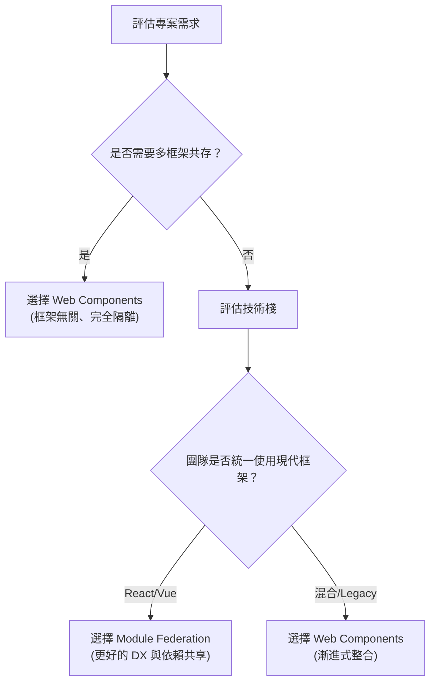

> 當前端應用規模逐漸擴大，如何讓多個團隊協作開發、獨立部署成為關鍵議題。微前端（Micro Frontends）正是為了解決這個問題而生的架構模式，而 Web Components 與 Module Federation 則是目前最主流的兩種實作方案。

## 為什麼需要微前端？

<Callout>
  微前端的核心價值在於：讓大型前端應用能像微服務一樣，由多個獨立團隊各自開發、測試、部署。
</Callout>

在深入比較之前，先來了解微前端要解決的核心問題：

- **團隊自治**：不同團隊可以獨立開發、測試、部署各自負責的功能模組
- **技術異構**：允許不同模組使用不同的框架或技術棧
- **漸進式遷移**：讓 legacy 系統可以逐步現代化，而非一次性重寫
- **獨立部署**：單一模組的更新不需要整個應用重新部署

---

## 概念比較總覽

| 特性       | Web Components       | Module Federation        |
| ---------- | -------------------- | ------------------------ |
| 標準化     | W3C 瀏覽器原生標準   | Webpack 5+ / Rspack 功能 |
| 框架依賴   | 框架無關             | 需要 bundler 支援        |
| 樣式隔離   | Shadow DOM 原生支援  | 需額外配置 CSS Modules   |
| 共享依賴   | 需手動處理           | 內建 shared 機制         |
| 運行時載入 | 透過 Custom Elements | 透過 remoteEntry.js      |
| 版本管理   | 較複雜               | 內建版本協商             |
| 學習曲線   | 中等                 | 較陡峭                   |
| 瀏覽器支援 | 現代瀏覽器原生支援   | 需要 bundler 編譯        |

---

## Web Components 深入解析

### 核心技術棧

Web Components 建立在三個瀏覽器原生 API 之上：

- **Custom Elements**：定義全新的 HTML 標籤，賦予其自訂行為
- **Shadow DOM**：建立獨立的 DOM 子樹，實現樣式與結構的完全封裝
- **HTML Templates**：定義可複用的 HTML 片段，搭配 `<slot>` 實現內容投射

### 實作範例：使用者卡片元件

以下範例展示如何建立一個具備響應式屬性的自定義元素：

```typescript
// user-card.ts
class UserCard extends HTMLElement {
  private shadow: ShadowRoot;

  constructor() {
    super();
    this.shadow = this.attachShadow({ mode: "open" });
  }

  // 宣告需要監聽變化的屬性
  static get observedAttributes() {
    return ["name", "avatar", "role"];
  }

  // 元素被加入 DOM 時觸發
  connectedCallback() {
    this.render();
  }

  // 監聽的屬性發生變化時觸發
  attributeChangedCallback(name: string, oldValue: string, newValue: string) {
    if (oldValue !== newValue) {
      this.render();
    }
  }

  private render() {
    const name = this.getAttribute("name") || "Unknown";
    const avatar = this.getAttribute("avatar") || "/default-avatar.png";
    const role = this.getAttribute("role") || "User";

    this.shadow.innerHTML = `
      <style>
        :host {
          display: block;
          font-family: system-ui, sans-serif;
        }
        .card {
          display: flex;
          align-items: center;
          gap: 1rem;
          padding: 1rem;
          border-radius: 8px;
          background: var(--card-bg, #f5f5f5);
          box-shadow: 0 2px 4px rgba(0,0,0,0.1);
        }
        .avatar {
          width: 60px;
          height: 60px;
          border-radius: 50%;
          object-fit: cover;
        }
        .info h3 {
          margin: 0 0 0.25rem;
          color: var(--text-primary, #333);
        }
        .info span {
          color: var(--text-secondary, #666);
          font-size: 0.875rem;
        }
      </style>
      <div class="card">
        
        <div class="info">
          <h3>${name}</h3>
          <span>${role}</span>
        </div>
      </div>
    `;
  }
}

customElements.define("user-card", UserCard);
```

註冊完成後，即可像使用原生 HTML 標籤一樣使用：

```html
<user-card name="Michael Lo" avatar="/images/michael.jpg" role="Frontend Engineer"> </user-card>
```

### 跨元件通訊：Custom Events

Web Components 之間的通訊仰賴瀏覽器原生的事件機制。使用 `CustomEvent` 時有兩個重要選項：

- `bubbles: true`：事件會向上冒泡至父元素
- `composed: true`：事件能穿透 Shadow DOM 邊界，讓外部也能監聽

```typescript
// notification-bell.ts
class NotificationBell extends HTMLElement {
  private shadow: ShadowRoot;
  private count = 0;

  constructor() {
    super();
    this.shadow = this.attachShadow({ mode: "open" });
  }

  connectedCallback() {
    this.shadow.innerHTML = `<button>🔔 <span>0</span></button>`;
    this.shadow.querySelector("button")?.addEventListener("click", () => {
      // composed: true 讓事件能穿透 Shadow DOM
      this.dispatchEvent(
        new CustomEvent("notification-click", {
          bubbles: true,
          composed: true,
          detail: { count: this.count },
        }),
      );
    });
  }

  setCount(count: number) {
    this.count = count;
    const span = this.shadow.querySelector("span");
    if (span) span.textContent = String(count);
  }
}

customElements.define("notification-bell", NotificationBell);

// 在應用層監聽事件（即使元件使用 Shadow DOM，事件仍可被捕獲）
document.addEventListener("notification-click", (e: CustomEvent) => {
  console.log("Notifications:", e.detail.count);
});
```

### 優缺點分析

<Tabs defaultValue="pros">
<TabsList>
<TabsTrigger value="pros">優點</TabsTrigger>
<TabsTrigger value="cons">缺點</TabsTrigger>
<TabsIndicator />
</TabsList>

<TabsContent value="pros">

- **零依賴**：瀏覽器原生支援，無需額外 runtime
  - **真正隔離**：Shadow DOM 提供完整的樣式封裝
  - **框架無關**：可在 React、Vue、Angular 甚至純 HTML 中使用
  - **面向未來**：W3C 標準，長期維護有保障

</TabsContent>

<TabsContent value="cons">

- **SSR 支援有限**：Declarative Shadow DOM 仍在演進中
  - **框架整合成本**：需要撰寫 wrapper 才能與 React/Vue 良好互動
  - **狀態管理**：缺乏內建的跨元件狀態共享機制
  - **開發體驗**：相較現代框架，少了許多便利的開發工具

</TabsContent>

</Tabs>

---

## Module Federation 深入解析

### 核心概念

Module Federation 是 Webpack 5 引入的革命性功能，讓多個獨立建構的應用程式能在運行時動態共享程式碼：

- **Host（宿主）**：載入並消費遠端模組的應用
- **Remote（遠端）**：暴露模組供其他應用使用
- **Shared（共享）**：多個應用共用的依賴，避免重複載入
- **Exposes（暴露）**：Remote 應用對外公開的模組清單

### 實作範例：Remote 應用配置

假設我們要將一個獨立的 React 應用作為 Remote，暴露其元件供其他應用使用：

```typescript
// apps/remote-app/webpack.config.ts
import { container } from "webpack";
const { ModuleFederationPlugin } = container;

export default {
  plugins: [
    new ModuleFederationPlugin({
      name: "remoteApp",
      filename: "remoteEntry.js",
      // 對外暴露的模組
      exposes: {
        "./Button": "./src/components/Button",
        "./UserProfile": "./src/components/UserProfile",
        "./utils": "./src/utils/helpers",
      },
      // 共享依賴配置
      shared: {
        react: {
          singleton: true, // 確保只有一個 React 實例
          requiredVersion: "^18.0.0",
          eager: false, // 延遲載入
        },
        "react-dom": {
          singleton: true,
          requiredVersion: "^18.0.0",
        },
        "@tanstack/react-query": {
          singleton: true,
          requiredVersion: "^5.0.0",
        },
      },
    }),
  ],
};
```

### 實作範例：Host 應用配置

Host 應用需要宣告要載入哪些 Remote，並配置相同的共享依賴：

```typescript
// apps/host-app/webpack.config.ts
import { container } from "webpack";
const { ModuleFederationPlugin } = container;

export default {
  plugins: [
    new ModuleFederationPlugin({
      name: "hostApp",
      remotes: {
        // 靜態配置
        remoteApp: "remoteApp@http://localhost:3001/remoteEntry.js",
        // 動態配置：支援運行時決定 Remote URL
        dynamicRemote: `promise new Promise(resolve => {
          const remoteUrl = window.REMOTE_URL || 'http://localhost:3002/remoteEntry.js';
          const script = document.createElement('script');
          script.src = remoteUrl;
          script.onload = () => resolve(window.dynamicRemote);
          document.head.appendChild(script);
        })`,
      },
      shared: {
        react: { singleton: true, requiredVersion: "^18.0.0" },
        "react-dom": { singleton: true, requiredVersion: "^18.0.0" },
      },
    }),
  ],
};
```

### 實作範例：動態載入遠端元件

在 Host 應用中，使用 `React.lazy` 搭配 `Suspense` 和 `ErrorBoundary` 優雅地載入遠端元件：

```tsx
// apps/host-app/src/App.tsx
import React, { Suspense, lazy } from "react";
import { ErrorBoundary } from "react-error-boundary";

// 靜態導入：路徑在 build time 確定
const RemoteButton = lazy(() => import("remoteApp/Button"));

// 動態導入工具函式
async function loadRemoteModule(scope: string, module: string) {
  // @ts-ignore - Webpack runtime API
  await __webpack_init_sharing__("default");
  const container = window[scope];
  // @ts-ignore
  await container.init(__webpack_share_scopes__.default);
  const factory = await container.get(module);
  return factory();
}

// 注意：lazy component 應在模組層級建立，避免重複渲染
const DynamicUserProfile = lazy(() => loadRemoteModule("remoteApp", "./UserProfile"));

function App() {
  return (
    <div>
      <h1>Host Application</h1>

      <ErrorBoundary fallback={<div>Remote component failed to load</div>}>
        <Suspense fallback={<div>Loading remote button...</div>}>
          <RemoteButton onClick={() => alert("Clicked!")}>Remote Button</RemoteButton>
        </Suspense>
      </ErrorBoundary>

      <ErrorBoundary fallback={<div>Profile unavailable</div>}>
        <Suspense fallback={<div>Loading profile...</div>}>
          <DynamicUserProfile userId="123" />
        </Suspense>
      </ErrorBoundary>
    </div>
  );
}

export default App;
```

### TypeScript 類型支援

為了獲得完整的類型提示，需要為遠端模組建立型別宣告：

```typescript
// apps/host-app/src/types/federated.d.ts
declare module "remoteApp/Button" {
  import { ComponentType, ButtonHTMLAttributes } from "react";

  interface ButtonProps extends ButtonHTMLAttributes<HTMLButtonElement> {
    variant?: "primary" | "secondary" | "ghost";
    size?: "sm" | "md" | "lg";
  }

  const Button: ComponentType<ButtonProps>;
  export default Button;
}

declare module "remoteApp/UserProfile" {
  import { ComponentType } from "react";

  interface UserProfileProps {
    userId: string;
    showDetails?: boolean;
  }

  const UserProfile: ComponentType<UserProfileProps>;
  export default UserProfile;
}
```

### 優缺點分析

<Tabs defaultValue="pros">
<TabsList>
<TabsTrigger value="pros">優點</TabsTrigger>
<TabsTrigger value="cons">缺點</TabsTrigger>
<TabsIndicator />
</TabsList>

<TabsContent value="pros">

- **運行時整合**：真正的動態載入，無需重新部署 Host
  - **智慧共享**：內建依賴共享與版本協商機制
  - **無縫整合**：與 React/Vue 等現代框架完美配合
  - **獨立部署**：各 Remote 可獨立發布，互不影響
  - **開發友好**：支援 HMR，TypeScript 類型提示完整

</TabsContent>

<TabsContent value="cons">

- **生態綁定**：依賴 Webpack 5+ 或 Rspack
  - **配置複雜**：shared 配置不當容易產生難以追蹤的問題
  - **調試困難**：共享依賴版本衝突時，錯誤訊息不夠直觀
  - **Runtime 開銷**：需要額外載入 federation runtime

</TabsContent>

</Tabs>

---

## 場景選擇指南

| 場景                 | 推薦方案          | 原因                          |
| -------------------- | ----------------- | ----------------------------- |
| 多框架混用           | Web Components    | 真正的框架無關，完全隔離      |
| 純 React/Vue 微前端  | Module Federation | 更好的 DX 與依賴共享          |
| 跨專案 Design System | Web Components    | 一次建構，所有框架皆可使用    |
| 大型企業級應用       | Module Federation | 完善的依賴管理與部署策略      |
| 需要 SSR             | Module Federation | Web Components SSR 支援不成熟 |
| Legacy 系統遷移      | Web Components    | 無需修改現有建構工具          |

---

## 進階：混合架構策略

在某些場景下，結合兩種方案能發揮最大效益。以下範例展示如何用 Web Component 包裝 Module Federation 元件，讓 federated 模組能在任何環境中使用：

```typescript
// federated-wrapper.ts
import React from "react";
import ReactDOM from "react-dom/client";

class FederatedWrapper extends HTMLElement {
  private root: ReactDOM.Root | null = null;
  private Component: React.ComponentType | null = null;

  static get observedAttributes() {
    return ["remote", "module", "props"];
  }

  async connectedCallback() {
    const remote = this.getAttribute("remote");
    const module = this.getAttribute("module");

    if (remote && module) {
      this.Component = await this.loadFederatedComponent(remote, module);
      this.render();
    }
  }

  private async loadFederatedComponent(scope: string, module: string) {
    // @ts-ignore
    await __webpack_init_sharing__("default");
    const container = window[scope];
    // @ts-ignore
    await container.init(__webpack_share_scopes__.default);
    const factory = await container.get(module);
    return factory().default;
  }

  private render() {
    if (!this.Component) return;

    const props = JSON.parse(this.getAttribute("props") || "{}");

    if (!this.root) {
      this.root = ReactDOM.createRoot(this);
    }

    this.root.render(React.createElement(this.Component, props));
  }

  disconnectedCallback() {
    this.root?.unmount();
  }
}

customElements.define("federated-wrapper", FederatedWrapper);
```

如此一來，即使在純 HTML 頁面或其他框架中，也能使用 federated 元件：

```html
<federated-wrapper remote="remoteApp" module="./UserProfile" props='{"userId": "123"}'>
</federated-wrapper>
```

---

## 如何選擇？



---

## 結語

**Web Components** 與 **Module Federation** 並非互斥的選擇，而是針對不同問題的解決方案：

- 當你需要**框架無關**的可攜性與**真正的樣式隔離**時，選擇 Web Components
- 當你在**現代框架生態系統**中需要**強大的依賴共享**與**開發體驗**時，選擇 Module Federation
- 在複雜的企業環境中，兩者**混合使用**往往能達到最佳效果

最終的選擇應基於團隊的技術棧、專案的實際需求，以及長期維護的成本考量。理解兩者的權衡取捨，才能為你的微前端架構做出最明智的決策。
